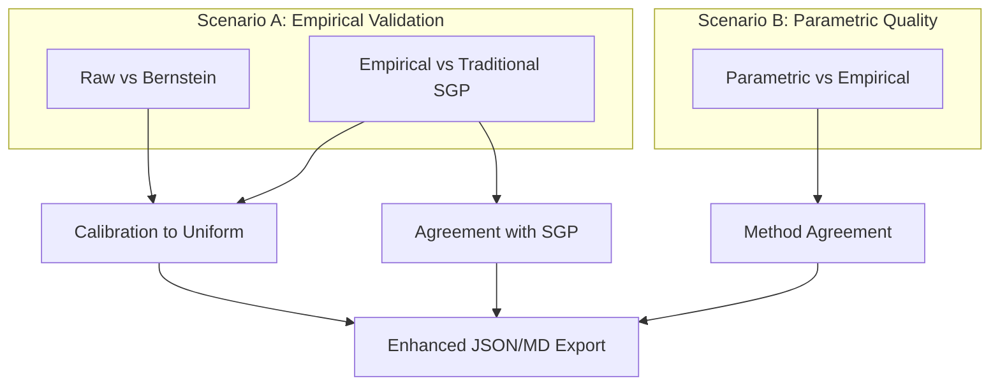

# Enhanced ECDF Comparison Statistics

## Overview

Update ECDF comparison plots to show different statistics based on narrative purpose:

- **Scenario A**: Empirical copula validation (prove it's a good baseline)
- **Scenario B**: Parametric approximation quality (how well does parametric match empirical)

## Architecture



## Changes to [`functions/copula_contour_plots.R`](functions/copula_contour_plots.R)

### 1. Create Helper Function for Enhanced Statistics

Add new function around line 970 (before existing comparison functions):

```r
#' Calculate enhanced ECDF comparison statistics
#' 
#' @param values1 First vector of values (0-100 scale)
#' @param values2 Second vector of values (0-100 scale)
#' @param u_prior Optional prior scores for conditional analysis
#' @param scenario Either "calibration" or "agreement"
calculate_ecdf_statistics <- function(values1, values2, 
                                     u_prior = NULL,
                                     scenario = c("calibration", "agreement"),
                                     label1 = "Method1",
                                     label2 = "Method2") {
  
  scenario <- match.arg(scenario)
  n <- length(values1)
  
  # Common metrics for both scenarios
  diff_raw <- values1 - values2
  mean1 <- mean(values1, na.rm = TRUE)
  mean2 <- mean(values2, na.rm = TRUE)
  
  # ECDFs
  ecdf1 <- ecdf(values1)
  ecdf2 <- ecdf(values2)
  x_grid <- seq(0, 100, length.out = 500)
  F1 <- ecdf1(x_grid)
  F2 <- ecdf2(x_grid)
  
  # Agreement metrics (both scenarios)
  spearman_rho <- cor(values1, values2, method = "spearman", use = "pairwise.complete.obs")
  wasserstein1 <- mean(abs(F1 - F2)) * 100  # In percentile points
  q90_abs_diff <- quantile(abs(diff_raw), 0.90, na.rm = TRUE)
  q95_abs_diff <- quantile(abs(diff_raw), 0.95, na.rm = TRUE)
  mae <- mean(abs(diff_raw), na.rm = TRUE)
  pct_large_diff <- mean(abs(diff_raw) > 10, na.rm = TRUE)
  
  # Two-sample KS
  ks_two_sample <- ks.test(values1 / 100, values2 / 100)
  ks_distance <- as.numeric(ks_two_sample$statistic)
  
  # CvM (integrated squared difference)
  cvm_stat <- mean((F1 - F2)^2)
  
  results <- list(
    n = n,
    mean1 = mean1,
    mean2 = mean2,
    median_diff = median(diff_raw, na.rm = TRUE),
    spearman_rho = spearman_rho,
    wasserstein1_pp = wasserstein1,
    q90_abs_diff = q90_abs_diff,
    q95_abs_diff = q95_abs_diff,
    mae = mae,
    pct_large_diff_10 = pct_large_diff,
    ks_distance = ks_distance,
    cvm_stat = cvm_stat
  )
  
  # Scenario A: Calibration metrics (vs uniform)
  if (scenario == "calibration") {
    # Uniformity tests for each curve
    ks1_uniform <- ks.test(values1 / 100, "punif")
    ks2_uniform <- ks.test(values2 / 100, "punif")
    
    results$ks_uniform_1 <- as.numeric(ks1_uniform$statistic)
    results$ks_uniform_2 <- as.numeric(ks2_uniform$statistic)
    
    # Anderson-Darling (tail-sensitive)
    ad_uniform_1 <- goftest::ad.test(values1 / 100, null = "punif")
    ad_uniform_2 <- goftest::ad.test(values2 / 100, null = "punif")
    
    results$ad_uniform_1 <- as.numeric(ad_uniform_1$statistic)
    results$ad_uniform_2 <- as.numeric(ad_uniform_2$statistic)
    
    # Discrete uniformity: max bin deviation
    bin_counts1 <- table(cut(values1, breaks = seq(0, 100, 10), include.lowest = TRUE))
    bin_props1 <- bin_counts1 / sum(bin_counts1)
    results$max_bin_dev_1 <- max(abs(bin_props1 - 0.1))
    
    bin_counts2 <- table(cut(values2, breaks = seq(0, 100, 10), include.lowest = TRUE))
    bin_props2 <- bin_counts2 / sum(bin_counts2)
    results$max_bin_dev_2 <- max(abs(bin_props2 - 0.1))
    
    # Conditional calibration if u_prior provided
    if (!is.null(u_prior) && length(u_prior) == n) {
      deciles <- cut(u_prior, breaks = seq(0, 1, 0.1), labels = 1:10, include.lowest = TRUE)
      
      decile_ks <- sapply(1:10, function(d) {
        idx <- which(deciles == d)
        if (length(idx) < 10) return(NA)
        ks_test <- ks.test(values1[idx] / 100, "punif")
        as.numeric(ks_test$statistic)
      })
      
      results$max_decile_ks <- max(decile_ks, na.rm = TRUE)
      results$worst_decile <- which.max(decile_ks)
    }
  }
  
  # Scenario B: Conditional agreement metrics
  if (scenario == "agreement" && !is.null(u_prior) && length(u_prior) == n) {
    deciles <- cut(u_prior, breaks = seq(0, 1, 0.1), labels = 1:10, include.lowest = TRUE)
    
    decile_large_diff <- sapply(1:10, function(d) {
      idx <- which(deciles == d)
      if (length(idx) < 10) return(NA)
      mean(abs(diff_raw[idx]) > 10, na.rm = TRUE)
    })
    
    results$worst_decile_pct_large <- max(decile_large_diff, na.rm = TRUE)
    results$worst_decile_num <- which.max(decile_large_diff)
  }
  
  return(results)
}
```

### 2. Update `plot_empirical_copula_comparison_with_sgpc` (lines ~973-1300)

**Purpose**: Raw vs Bernstein empirical copulas (Scenario A: Calibration)

Replace statistics calculation (lines 1060-1083) and annotation (lines 1148-1162):

```r
# Calculate enhanced statistics (SCENARIO A: Calibration)
stats <- calculate_ecdf_statistics(
  values1 = s_raw,
  values2 = s_bern,
  u_prior = u_prior,
  scenario = "calibration",
  label1 = "Raw",
  label2 = "Bernstein"
)

# Compact stats box for plot (essential calibration metrics)
if (show_stats) {
  stats_label <- sprintf(
    paste0(
      "n = %s\n",
      "KS(Raw→U) = %.3f | KS(Bern→U) = %.3f\n",
      "AD(Raw→U) = %.2f | AD(Bern→U) = %.2f\n",
      "Max bin dev: %.3f | %.3f\n",
      "Agreement: ρ_s = %.3f | W₁ = %.1f pp\n",
      "Q90(|Δ|) = %.1f | P(|Δ|>10) = %.3f"
    ),
    format(stats$n, big.mark = ","),
    stats$ks_uniform_1, stats$ks_uniform_2,
    stats$ad_uniform_1, stats$ad_uniform_2,
    stats$max_bin_dev_1, stats$max_bin_dev_2,
    stats$spearman_rho, stats$wasserstein1_pp,
    stats$q90_abs_diff, stats$pct_large_diff_10
  )
  
  p_ecdf <- p_ecdf +
    annotate("label", x = 2, y = 0.98, hjust = 0, vjust = 1,
             label = stats_label, size = 2.3,
             fill = "white", alpha = 0.85,
             label.padding = unit(0.25, "lines"))
}

# Export full statistics to return value
statistics <- stats
```

### 3. Update `plot_sgpc_comparison_panel` (lines ~2616-3030)

**Purpose**: Parametric vs Empirical copula (Scenario B: Agreement)

Replace statistics calculation (lines 2686-2706) and annotation (lines 2799-2817):

```r
# Calculate enhanced statistics (SCENARIO B: Agreement)
stats <- calculate_ecdf_statistics(
  values1 = s_emp,
  values2 = s_par,
  u_prior = u_obs,
  scenario = "agreement",
  label1 = "Empirical",
  label2 = family_title
)

# Compact stats box for plot (essential agreement metrics)
if (show_stats) {
  stats_label <- sprintf(
    paste0(
      "n = %s\n",
      "mean (Emp/Par): %.1f / %.1f\n",
      "Agreement: ρ_s = %.3f | W₁ = %.1f pp\n",
      "Deviation: Q90(|Δ|) = %.1f | Q95 = %.1f\n",
      "P(|Δ|>10) = %.3f | MAE = %.2f\n",
      "KS (2-sample) = %.4f"
    ),
    format(stats$n, big.mark = ","),
    stats$mean1, stats$mean2,
    stats$spearman_rho, stats$wasserstein1_pp,
    stats$q90_abs_diff, stats$q95_abs_diff,
    stats$pct_large_diff_10, stats$mae,
    stats$ks_distance
  )
  
  p_ecdf <- p_ecdf +
    annotate("label", x = 2, y = 0.98, hjust = 0, vjust = 1,
             label = stats_label, size = 2.3,
             fill = "white", alpha = 0.85,
             label.padding = unit(0.25, "lines"))
}

# Export full statistics (including conditional metrics if calculated)
statistics <- stats
```

### 4. Update `plot_empirical_vs_sgp_dual_pct` (lines ~3312-3600)

**Purpose**: Empirical copula vs Traditional SGP (Scenario A: Calibration + SGP agreement)

Replace statistics calculation (lines 3358-3378) and annotation (lines 3429-3446):

```r
# Calculate enhanced statistics (SCENARIO A with SGP focus)
stats <- calculate_ecdf_statistics(
  values1 = s_sgpc,
  values2 = s_sgp,
  u_prior = u_prior,
  scenario = "calibration",
  label1 = "SGPc",
  label2 = "SGP"
)

# Compact stats box emphasizing SGP comparison
if (show_stats) {
  stats_label <- sprintf(
    paste0(
      "n = %s\n",
      "KS(SGPc→U) = %.3f | KS(SGP→U) = %.3f\n",
      "vs SGP: ρ_s = %.3f | W₁ = %.1f pp\n",
      "Q90(|Δ|) = %.1f | P(|Δ|>10) = %.3f\n",
      "Max decile KS: %.3f (decile %d)"
    ),
    format(stats$n, big.mark = ","),
    stats$ks_uniform_1, stats$ks_uniform_2,
    stats$spearman_rho, stats$wasserstein1_pp,
    stats$q90_abs_diff, stats$pct_large_diff_10,
    stats$max_decile_ks, stats$worst_decile
  )
  
  p_ecdf <- p_ecdf +
    annotate("label", x = 2, y = 0.98, hjust = 0, vjust = 1,
             label = stats_label, size = 2.3,
             fill = "white", alpha = 0.85,
             label.padding = unit(0.25, "lines"))
}

statistics <- stats
```

### 5. Enhanced JSON/MD Export

Update the JSON export sections in all three functions to include full statistics object:

```r
# In return value
return(list(
  combined_plot = final_plot,
  ecdf_plot = p_ecdf,
  heatmap_plot = p_heatmap,
  statistics = statistics,  # Full enhanced stats
  scenario = "calibration"  # or "agreement"
))
```

## Dependencies

Add `goftest` package check at top of file (around line 10):

```r
# Check for optional statistical test packages
if (!requireNamespace("goftest", quietly = TRUE)) {
  warning("Package 'goftest' not available. Anderson-Darling tests will be skipped.\n",
          "Install with: install.packages('goftest')")
}
```

## Key Metrics Summary

**Scenario A (Empirical Validation)**:

- Calibration: KS_u, AD_u, max_bin_dev (per curve)
- Agreement: Spearman ρ, Wasserstein-1, Q90(|Δ|), P(|Δ|>10)
- Conditional: max_decile_KS

**Scenario B (Parametric Quality)**:

- Agreement: Spearman ρ, Wasserstein-1, Q90/Q95(|Δ|), MAE, P(|Δ|>10)
- Distributional: 2-sample KS
- Conditional: worst_decile P(|Δ|>10)

## Testing

After implementation, test with:

1. Raw vs Bernstein comparison (should show near-perfect calibration)
2. Parametric vs Empirical comparison (should show method agreement)
3. Empirical vs Traditional SGP (should show both calibration and SGP agreement)