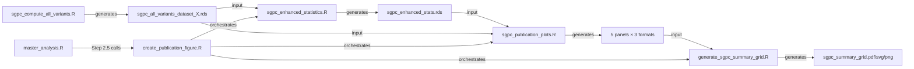

# STEP 2: Publication Figure Generation - Usage Guide

## Overview

A complete publication-grade visualization system for STEP 2 SGPc sensitivity analysis, featuring a **2×3 grid** with 5 panels demonstrating insensitivity to copula choice at multiple levels of aggregation.

**Created:** January 30, 2026  
**Status:** Ready for testing

---

## What Was Implemented

### New Files Created

1. **`sgpc_enhanced_statistics.R`** - Computes additional statistics:
   - Individual-level quantiles and exceedance rates
   - Group-level aggregates (school/district means)
   - Rank agreement (Spearman ρ by condition)
   - Decile misclassification rates

2. **`sgpc_publication_plots.R`** - Five plotting functions:
   - `plot_individual_ecdf()` - Panel A: Individual-level ECDF
   - `plot_group_ecdf()` - Panel B: Group-level ECDF (schools/districts)
   - `plot_condition_dots()` - Panel C: Condition-level MAD with dots
   - `plot_rank_agreement()` - Panel D1: Spearman correlations
   - `plot_decile_stability()` - Panel D2: Classification stability
   - `save_plot_multi()` - Helper to save PDF/SVG/PNG

3. **`generate_sgpc_summary_grid.R`** - LaTeX grid assembly:
   - Flexible 2×3 or 3×2 layouts
   - Auto-compilation with tinytex or system pdflatex
   - Multi-format export (PDF/SVG/PNG)

4. **`create_publication_figure.R`** - Master orchestration script:
   - Loads data
   - Computes enhanced statistics
   - Generates all 5 panels
   - Assembles grid
   - Exports in all formats

### Modified Files

1. **`sgpc_compute_all_variants.R`** (lines 134-146):
   - Now preserves `SCHOOL_NUMBER` and `DISTRICT_NUMBER` for group-level analysis

2. **`master_analysis.R`** (lines 1170-1192):
   - Added Step 2.5 call to `create_publication_figure.R`
   - Updated summary output to list publication figure
   - Updated review checkpoint message

---

## Quick Start: Generate Publication Figure

### Option 1: Integrated with Master Analysis (Recommended)

If you **already have results** from the current Step 2.1 run (which does NOT have school IDs yet):

```r
# First, re-run Step 2.1 to add school/district IDs
DATASETS_TO_RUN <- c("dataset_4")
STEPS_TO_RUN <- c(2)
USE_PARALLEL_STEP2 <- TRUE

source("master_analysis.R")
```

This will:
1. Re-compute Step 2.1 with school IDs (~25 min)
2. Run Step 2.2 (aggregate analysis) 
3. Run Step 2.3 (basic visualizations)
4. Run Step 2.4 (narrative report)
5. **Run Step 2.5 (publication figure)** ← NEW!

### Option 2: Standalone (If Step 2.1-2.4 Already Complete)

```r
# Just generate the publication figure from existing data
source("STEP_2_SGPc_Sensitivity/create_publication_figure.R")
```

**Note:** If your current data doesn't have `SCHOOL_NUMBER`/`DISTRICT_NUMBER`, Panel B will be skipped with a placeholder. Re-run Step 2.1 to get complete results.

---

## Output Files

All outputs saved to: `STEP_2_SGPc_Sensitivity/results/visualizations/`

### Individual Panels (5 plots × 3 formats = 15 files)

```
panel_a_individual_ecdf.pdf
panel_a_individual_ecdf.svg
panel_a_individual_ecdf.png

panel_b_group_ecdf.pdf
panel_b_group_ecdf.svg
panel_b_group_ecdf.png

panel_c_condition_dots.pdf
panel_c_condition_dots.svg
panel_c_condition_dots.png

panel_d1_rank_agreement.pdf
panel_d1_rank_agreement.svg
panel_d1_rank_agreement.png

panel_d2_decile_stability.pdf
panel_d2_decile_stability.svg
panel_d2_decile_stability.png
```

### Assembled Grid (1 figure × 3 formats = 3 files)

```
sgpc_summary_grid.pdf  ← Main publication figure
sgpc_summary_grid.svg
sgpc_summary_grid.png
```

### Cached Statistics

```
../sgpc_enhanced_stats.rds  ← Cached for fast re-plotting
```

---

## Figure Layout

```
┌─────────────────────────────────┬─────────────────────────────────┐
│  (A) Individual-Level ECDF      │  (B) Group-Level ECDF          │
│  - Shows student-level Δ        │  - Shows school-level Δ_g      │
│  - 5 comparison curves          │  - Dramatic left-shift         │
│  - Reference lines at 5, 10     │  - √n aggregation effect       │
└─────────────────────────────────┴─────────────────────────────────┘
┌────────────────┬───────────────────┬──────────────────────────────┐
│ (C) Condition  │ (D1) Rank         │ (D2) Decile                  │
│     Replication│      Agreement    │      Stability               │
│ - 182 dots     │ - Spearman ρ      │ - Classification rates       │
│ - Faceted by   │ - Median/IQR      │ - Stacked bars               │
│   year × area  │ - All ρ ≥ 0.98    │ - Exact/±1/≥2 match         │
└────────────────┴───────────────────┴──────────────────────────────┘
```

**Dimensions:** 16" × 12" (suitable for full-page journal figure)

---

## The 5 Comparison Pairs

All panels include these comparisons (color-coded consistently):

1. **Emp-Best** (Blue): Empirical vs best-fit parametric - core comparison
2. **Emp-Canonical** (Orange): Empirical vs averaged canonical - generalizability
3. **Best-Canonical** (Green): Best-fit vs canonical - stability check
4. **Emp-Gaussian** (Red): Empirical vs Gaussian - mis-specification test
5. **Emp-Comonotonic** (Purple): Empirical vs comonotonic - TAMP assumption

---

## Key Statistics Computed

### Individual-Level (Panel A)
- Median |Δ|, Q90, Q95, Q99 for each comparison
- P(|Δ| > 5), P(|Δ| > 10) - exceedance rates
- Full ECDF for visualization

### Group-Level (Panel B)
- Median |Δ_g| for schools/districts (n ≥ 10)
- Q90, Q95 group differences
- Aggregation effect quantification

### Condition-Level (Panel C)
- MAD for each of 182 conditions
- Median and IQR by year_span × content_area strata
- Full dot distribution (not just cell means)

### Rank Stability (Panel D1)
- Spearman ρ for each condition
- Median and range by strata
- Shows monotonic relationship preservation

### Classification Stability (Panel D2)
- % exact decile match
- % within ±1 decile
- % ≥2 deciles different
- Stratified by year span or content area

---

## Customization Options

### Change Which Comparisons to Display

Edit `create_publication_figure.R` line ~110:

```r
# Show only core comparisons
comparisons_to_plot <- c("Emp-Best", "Emp-Canonical", "Best-Canonical")

plots$panel_a <- plot_individual_ecdf(enhanced_stats, comparisons = comparisons_to_plot)
# ... apply to all plot calls
```

### Change Grid Layout

Edit `create_publication_figure.R` line ~200:

```r
generate_sgpc_summary_grid_latex(
  plot_files = panel_files,
  output_dir = VIZ_DIR,
  layout = "3x2",  # ← Change from "2x3" to "3x2"
  ...
)
```

### Change Plot Dimensions

Edit `create_publication_figure.R` lines ~95-101:

```r
PLOT_DIMS <- list(
  panel_a = list(width = 10, height = 7),  # ← Adjust as needed
  panel_b = list(width = 10, height = 7),
  ...
)
```

### Panel D2 Stratification

Edit `create_publication_figure.R` line ~167:

```r
plots$panel_d2 <- plot_decile_stability(
  enhanced_stats, 
  stratify_by = "content_area"  # ← Change from "year_span" to "content_area"
)
```

---

## Troubleshooting

### Issue: Panel B shows placeholder OR "SCHOOL_NUMBER not found" error

**Cause:** Either:
1. Old Step 2.1 results don't have populated `SCHOOL_NUMBER`/`DISTRICT_NUMBER` (all NA), OR
2. Source data is missing these columns entirely

**Fix for (1) - Re-run Step 2.1:**
```r
# Delete old results
file.remove("STEP_2_SGPc_Sensitivity/results/sgpc_all_variants_dataset_4.rds")

# Re-run
DATASETS_TO_RUN <- c("dataset_4")
STEPS_TO_RUN <- c(2)
USE_PARALLEL_STEP2 <- TRUE
source("master_analysis.R")
```

**Fix for (2) - Check source data:**
```r
# Verify columns exist in source
data <- readRDS("SGP/dataset_4.Rdata")  # Or your actual path
"SCHOOL_NUMBER" %in% names(data)
sum(!is.na(data$SCHOOL_NUMBER))  # Should be > 0
```

If missing from source, analysis will **stop with clear error** (as of Jan 31, 2026 fix).

---

### Issue: Decile classification errors

**Cause:** Some SGPc variants (especially `sgpc_comonotonic`) have very low variance in certain conditions, causing non-unique quantile breaks.

**Fix:** Now handled automatically with intelligent fallback:
1. Tries deciles (10 bins)
2. Falls back to quintiles (5 bins) if needed
3. Returns NA only for extreme cases
4. Reports issues in terminal and figure captions

**Interpretation:** If comonotonic has classification failures, this is **scientifically informative** - it means the comonotonic assumption produces unrealistically concentrated predictions.

---

### Issue: LaTeX compilation fails

**Option 1:** Install tinytex (recommended):
```r
install.packages("tinytex")
tinytex::install_tinytex()
```

**Option 2:** Use system pdflatex (if available):
```bash
which pdflatex  # Check if installed
```

**Option 3:** Use only individual panels (skip grid):
- All 5 panels are saved separately in PDF/SVG/PNG
- Assemble manually in Illustrator/Inkscape if needed

---

### Issue: SVG/PNG export fails

**For SVG:** Install pdf2svg or Inkscape:
```bash
# macOS
brew install pdf2svg

# or
brew install --cask inkscape
```

**For PNG:** Install ImageMagick:
```bash
brew install imagemagick
```

---

## Testing Workflow

### Test on dataset_4 (smallest, 182 conditions)

```r
# Full re-run with new school IDs
DATASETS_TO_RUN <- c("dataset_4")
STEPS_TO_RUN <- c(2)
USE_PARALLEL_STEP2 <- TRUE

source("master_analysis.R")
```

**Expected time:** ~25-30 minutes total
- Step 2.1: 23-24 min (182 conditions)
- Step 2.2: 5-10 sec
- Step 2.3: 10 sec
- Step 2.4: 2-5 sec
- **Step 2.5: 2-3 min** (new)

---

### Validate on dataset_1 (largest, 510 conditions)

```r
DATASETS_TO_RUN <- c("dataset_1")
STEPS_TO_RUN <- c(2)
USE_PARALLEL_STEP2 <- TRUE

source("master_analysis.R")
```

**Expected time:** ~70-80 minutes total
- Step 2.1: 65-70 min (510 conditions)
- Remaining steps: ~5 min

---

## What Each Panel Shows

### Panel A: Individual-Level ECDF
**Answers:** "How often do individual students' SGPc values differ by >5 or >10 points?"

**Key insight:** For Emp-Best, ~85% of students differ by <5 points, ~97% by <10 points.

---

### Panel B: Group-Level ECDF  
**Answers:** "When we aggregate by school, do differences shrink?"

**Key insight:** Group median Δ is ~1-2 points (vs 3-4 individual) - shows √n effect.

---

### Panel C: Condition-Level Dots
**Answers:** "Is this pattern consistent across all 182 conditions, or cherry-picked?"

**Key insight:** Dots show full replication distribution. Tight clustering = robust finding.

---

### Panel D1: Rank Agreement
**Answers:** "Do methods preserve student orderings (who's ahead of whom)?"

**Key insight:** Median Spearman ρ ≥ 0.98 = orderings nearly identical.

---

### Panel D2: Classification Stability
**Answers:** "Does copula choice change accountability classifications (deciles)?"

**Key insight:** 70-85% exact decile match, 95%+ within ±1 decile = stable decisions.

---

## File Dependencies



---

## Next Steps

1. **Immediate:** Re-run Step 2.1 on dataset_4 to regenerate data with school IDs
   
2. **Review:** Check individual panels before assembling grid
   ```bash
   open STEP_2_SGPc_Sensitivity/results/visualizations/panel_a_individual_ecdf.pdf
   # ... review each panel
   ```

3. **Customize:** Adjust colors, dimensions, or comparisons in plotting functions if needed

4. **Scale Up:** Once validated on dataset_4, run on all 4 datasets for comprehensive figure

5. **Publish:** Use `sgpc_summary_grid.pdf` as main figure in paper

---

## Pro Tips

### Generate Figure Without Re-Running All Steps

If Step 2.1-2.4 already complete with correct data:

```r
source("STEP_2_SGPc_Sensitivity/create_publication_figure.R")
```

This runs in ~2-3 minutes and regenerates all panels + grid.

---

### Force Statistics Recomputation

Delete the cache file:

```bash
rm STEP_2_SGPc_Sensitivity/results/sgpc_enhanced_stats.rds
```

Then re-run `create_publication_figure.R`.

---

### Export Only Specific Formats

Edit `create_publication_figure.R` line ~200:

```r
export_formats = c("pdf")  # Skip SVG/PNG to save time
```

---

### Generate Individual Panels Only (Skip Grid)

Comment out grid assembly section in `create_publication_figure.R` (lines ~180-220).

---

## Expected Output Messages

```
====================================================================
STEP 2: CREATING PUBLICATION-GRADE SGPc SENSITIVITY FIGURE
====================================================================

Starting time: 2026-01-30 10:30:00

====================================================================
STEP 1: LOADING DATA
====================================================================

Combined dataset: 1,918,720 observations, 182 conditions
✓ Group identifiers found: SCHOOL_NUMBER=TRUE, DISTRICT_NUMBER=TRUE

====================================================================
STEP 2: COMPUTING ENHANCED STATISTICS
====================================================================

Computing individual-level statistics...
  Emp-Best: median=3.1, Q95=12.5, P(>5)=15.3%, P(>10)=2.8%
  ...

Computing group-level statistics (school/district aggregates)...
  Grouping by: SCHOOL_NUMBER
  Emp-Best: 2,450 groups, median group Δ=1.2 (vs individual median=3.1)
  ...

Computing rank agreement (Spearman ρ by condition)...
  Emp-Best: median ρ=0.9845, min ρ=0.9801
  ...

Computing decile misclassification rates...
  Emp-Best: 73.2% exact, 23.1% ±1, 3.7% ≥2 deciles different
  ...

✓ Cached enhanced statistics to: STEP_2_SGPc_Sensitivity/results/sgpc_enhanced_stats.rds

====================================================================
STEP 3: GENERATING PUBLICATION PLOTS
====================================================================

Generating Panel A (Individual-level ECDF)...
  Saved: .../panel_a_individual_ecdf.pdf
  Saved: .../panel_a_individual_ecdf.svg
  Saved: .../panel_a_individual_ecdf.png

... (4 more panels)

====================================================================
STEP 4: ASSEMBLING PUBLICATION GRID
====================================================================

  ✓ LaTeX source written: sgpc_summary_grid.tex
  ✓ PDF compiled via tinytex: sgpc_summary_grid.pdf
  ✓ SVG exported: sgpc_summary_grid.svg
  ✓ PNG exported: sgpc_summary_grid.png

====================================================================
PUBLICATION FIGURE GENERATION COMPLETE
====================================================================
```

---

## Validation Checklist

Before using in publication:

- [ ] All 5 panels render correctly in individual PDFs
- [ ] Panel B shows real data (not placeholder)
- [ ] Grid assembly compiles without errors
- [ ] All 3 export formats (PDF/SVG/PNG) are generated
- [ ] Text is legible at print size (300 DPI)
- [ ] Colors are distinguishable (test with colorblind simulator)
- [ ] Legends are complete and correctly positioned
- [ ] Axis labels and units are clear
- [ ] Statistical annotations are accurate
- [ ] Figure validates on dataset_1 (largest dataset)

---

## Design Rationale

### Why 2×3 Layout?

- **Row 1 (wide panels):** ECDFs need horizontal space to show full distribution
- **Row 2 (narrow panels):** Faceted plots work well in compact format
- **Coherent narrative:** Left → Right = increasing aggregation/abstraction
  - C: Conditions → D1: Ranks → D2: Classifications

### Why These 5 Comparisons?

1. **Emp-Best:** Core question - does our fitting procedure work?
2. **Emp-Canonical:** Generalizability - do averaged parameters work?
3. **Best-Canonical:** Stability - how much do fitted vs averaged differ?
4. **Emp-Gaussian:** Robustness - what if we mis-specify?
5. **Emp-Comonotonic:** Baseline - how wrong is TAMP's assumption?

### Why Wes Anderson "Zissou1" Colors?

- **Consistency:** Matches STEP_1's carefully designed aesthetic
- **Professional:** High-quality cinematic palette (from "The Life Aquatic")
- **Distinctive:** 5 colors extracted from continuous gradient for maximum separation
- **Print-ready:** Works well in both color and grayscale

### Why ECDFs vs Histograms?

- **Policy-relevant:** Directly answers "% of students with |Δ| > X"
- **Robust:** No binning artifacts or arbitrary bandwidth choices
- **Comparable:** Same x-axis scale across panels A and B makes aggregation effect obvious

---

## Future Enhancements

### Currently Not Implemented (Easy to Add)

1. **Panel B inset scatter:** |Δ_g| vs n_g showing √n effect visually
2. **Panel C color by best-fit family:** Show if Clayton/Gumbel/etc. behave differently
3. **Interactive HTML version:** Convert to plotly for web exploration
4. **Appendix figures:** Separate plots for each comparison pair
5. **Animation:** Transition from individual → group → classification levels

### If You Want to Add These

Modify plotting functions in `sgpc_publication_plots.R` or create new variants.

---

## Credits

**Design inspiration:** STEP 1's `generate_summary_grid_latex()` function (lines 5914-6513)  
**Statistical framework:** Based on enhanced Step 2.2 aggregate analysis  
**Visual grammar:** "Dots as replications" following Tufte and Cleveland principles  
**Implementation:** dataimago, January 2026
