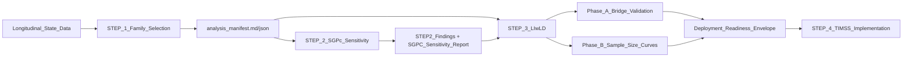

# Project Structure: How STEP 1, STEP 2, and STEP 3 Work Together

## Purpose

This document explains the architecture of the project up to STEP 3 as a staged uncertainty-control pipeline for:

- longitudinal settings (where truth is observable), and
- cold-start settings (where only unlinked cross-sectional data are available, such as TIMSS/NAEP-style use cases).

---

## One-line summary

The project is designed so that:

1. **STEP 1** learns a defensible canonical dependence template,
2. **STEP 2** quantifies the penalty for using that template instead of empirical truth,
3. **STEP 3** uses that template to infer subgroup growth from unlinked marginals and quantifies both bridge error and sample-size error.

---

## Pipeline map

---

## STEP 1: Identify the canonical dependence template

Primary file:

- `STEP_1_Family_Selection/results/dataset_all/analysis_manifest.md`

What STEP 1 does:

- Fits multiple copula families across all available linked conditions.
- Determines which family most often wins and summarizes parameter envelopes by year span/content area.

Core findings used downstream:

- family frequency: `t` best in `63.6%` of conditions, `frank` in `30.7%`, `gumbel` `3.6%`, `gaussian` `2.1%`
- recommended parameters by year span (for cold-start transfer)

Why STEP 1 matters:

- It gives STEP 2 and STEP 3 a principled canonical kernel instead of ad hoc assumptions (especially instead of comonotonic TAMP defaults).

Residual risk carried forward:

- canonical parameters average over heterogeneity, so some strata will be less well represented.

---

## STEP 2: Quantify SGPc sensitivity to copula choice

Primary files:

- `STEP_2_SGPc_Sensitivity/results/SGPC_SENSITIVITY_REPORT.md`
- `STEP_2_SGPc_Sensitivity/results/STEP2_FINDINGS_SUMMARY.md`

What STEP 2 does:

- Treats SGPc as a functional of copula and computes how much SGPc shifts under alternative copula choices.
- Compares empirical vs best-fit parametric vs canonical vs mis-specified choices.

Core evidence:

- empirical vs best-fit parametric: `MAD = 2.9`, `r = 0.985`
- empirical vs canonical: `MAD = 3.8`, `r = 0.979`
- empirical vs Gaussian: `MAD = 8.7`, `r = 0.930`
- empirical vs comonotonic (TAMP): `MAD = 26.1`, `r = 0.811`

What STEP 2 contributes to the architecture:

- It validates that canonical is not perfect, but is operationally acceptable and far better than naive alternatives.
- It converts copula choice into a known error envelope, which becomes prior context for STEP 3.

Residual risk carried forward:

- hotspot strata remain (for example, some math grade-transition configurations), so STEP 3 must still stress-test sensitivity and precision.

---

## STEP 3: Infer subgroup growth from unlinked data and decompose uncertainty

Primary files:

- `STEP_3_LIwLD/README.md`
- `STEP_3_LIwLD/results/phase_a_manifest.json`
- `STEP_3_LIwLD/results/step3_manifest.json`
- `STEP_3_LIwLD/results/phase_b_precision_by_n.csv`

What STEP 3 does:

- Marries canonical copula kernel + growth regime family to infer subgroup growth regime from unlinked marginals.
- Separates uncertainty into:
  - **Error 2 (Inference/Bridge):** model-bridge cost at full subgroup N
  - **Error 1 (Sampling):** finite-N precision loss from cross-sectional sampling

How STEP 3 is structured:

- **Phase A:** single-condition deep validation against known longitudinal truth
- **Phase B:** systematic precision operating curves by `N` bucket and design cells
- **Phase C:** publication outputs/manifests

Current run evidence (from manifest):

- Phase A median error: `+0.74` SGP points (inferred 45.74 vs true 45.00)
- Phase B precision table by N available for `1000, 2500, 5000, 7500, 10000`
- NAEP/TIMSS reference sizes explicitly encoded (`3000-4000`, `>=4000`)

What STEP 3 adds relative to STEP 2:

- STEP 2 asks: "How sensitive is SGPc to copula choice when we have linked truth?"
- STEP 3 asks: "Can we recover subgroup growth without linked data, and what do inference + sampling jointly cost?"

---

## Artifact handoff (concrete dependency chain)

1. STEP 1 produces canonical dependence recommendations in:
   - `STEP_1_Family_Selection/results/dataset_all/analysis_manifest.md`
2. STEP 2 quantifies canonical penalty and mis-specification risks in:
   - `STEP_2_SGPc_Sensitivity/results/SGPC_SENSITIVITY_REPORT.md`
   - `STEP_2_SGPc_Sensitivity/results/STEP2_FINDINGS_SUMMARY.md`
3. STEP 3 consumes STEP 1 canonical assumptions plus STEP 2 context and exports:
   - bridge-validation evidence (`phase_a_manifest.json`)
   - precision operating table (`phase_b_precision_by_n.csv`, `step3_manifest.json`)
   - deployable interpretation artifacts (`step3_manifest.md/json`, visualizations)

---

## What each step buys you

| Step | Statistical role | Practical role | Residual risk after this step |
|---|---|---|---|
| STEP 1 | Select canonical copula family and parameter envelopes | Enables cold-start dependence specification | Canonical averaging can miss stratum-specific structure |
| STEP 2 | Quantify SGPc sensitivity to copula choice | Establishes bounded canonical penalty and rejects naive assumptions | Some hotspots show larger canonical penalty |
| STEP 3 | Infer subgroup growth from unlinked marginals and decompose Error 1/Error 2 | Gives operational uncertainty for NAEP/TIMSS-scale use | Assumption sensitivity (`P_S ⊥ U`) and stratum heterogeneity still require monitoring |

---

## Why this structure is methodologically coherent

The architecture intentionally avoids jumping directly to unlinked inference:

- STEP 1 solves "what dependence template is defensible?"
- STEP 2 solves "how costly is that template choice in practice?"
- STEP 3 solves "with that template, what can we recover without linkage, and with what uncertainty?"

This ordering is what makes STEP 4 credible: by the time TIMSS deployment starts, both dependence-choice error and sampling/inference error are already quantified in the linked-data sandbox.

---

## Implication for STEP 4 (TIMSS)

By design, STEP 4 is not a fresh modeling gamble. It is a transfer step built on:

- canonical dependence learned in STEP 1,
- sensitivity envelope quantified in STEP 2,
- unlinked inference operating characteristics quantified in STEP 3.

So STEP 4 should be interpreted as deployment under a documented error budget, not a first-principles estimation exercise.
